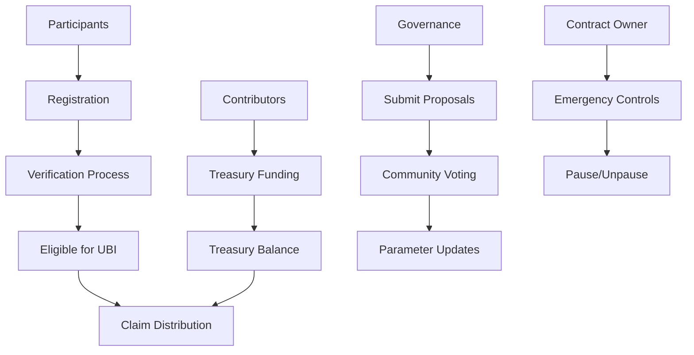

# BitStack UBI - Decentralized Universal Basic Income Protocol

[](LICENSE)
[](https://stacks.co)
[](https://clarity-lang.org)

## Overview

BitStack UBI is a decentralized Universal Basic Income protocol built on the Stacks blockchain, leveraging Bitcoin's security to provide sustainable and transparent UBI distribution. The protocol enables participants to register, undergo verification, and receive periodic STX distributions from a community-managed treasury through democratic governance.

### Key Features

- **Bitcoin-Secured**: Built on Stacks Layer 2 for Bitcoin security
- **Democratic Governance**: Community-driven parameter adjustments
- **Transparent Operations**: All distributions and activities are on-chain
- **Emergency Controls**: Pause/unpause functionality for security
- **Comprehensive Tracking**: Complete audit trail of participant activity

## System Overview



## Contract Architecture

### Core Components

#### 1. **Participant Management**

- Registration system for new users
- Verification process (admin-controlled)
- Eligibility checking for UBI claims
- Comprehensive tracking of participant activity

#### 2. **Treasury System**

- Community-funded treasury
- Automatic distribution calculations
- Balance management and validation
- Contribution tracking

#### 3. **Governance Framework**

- Proposal submission system
- Democratic voting mechanism
- Parameter adjustment capabilities
- Voting period management

#### 4. **Emergency Controls**

- Contract pause/unpause functionality
- Owner-only administrative functions
- Emergency intervention capabilities

### Data Structures

```clarity
;; Participant Information
{
  registered: bool,
  last-claim-height: uint,
  total-claimed: uint,
  verification-status: bool,
  join-height: uint,
  claims-count: uint
}

;; Governance Proposals
{
  proposer: principal,
  proposal-type: (string-ascii 32),
  proposed-value: uint,
  votes-for: uint,
  votes-against: uint,
  status: (string-ascii 10),
  expiry-height: uint
}
```

## Data Flow

### 1. Participant Onboarding Flow

```
Registration → Verification → Eligibility Check → UBI Claims
```

### 2. Treasury Management Flow

```
Contributions → Treasury Balance → Distribution Calculation → Payment
```

### 3. Governance Flow

```
Proposal Submission → Voting Period → Vote Counting → Parameter Update
```

## Getting Started

### Prerequisites

- [Clarinet](https://github.com/hirosystems/clarinet) - Stacks development environment
- [Node.js](https://nodejs.org/) - For testing framework
- [Git](https://git-scm.com/) - Version control

### Installation

1. **Clone the repository**

   ```bash
   git clone https://github.com/carlton-source/bitstack.git
   cd bitstack
   ```

2. **Install dependencies**

   ```bash
   npm install
   ```

3. **Check contract syntax**

   ```bash
   clarinet check
   ```

4. **Run tests**

   ```bash
   npm test
   ```

### Project Structure

```
bitstack/
├── contracts/
│   └── bitstack.clar          # Main UBI contract
├── settings/
│   ├── Devnet.toml           # Development network settings
│   ├── Testnet.toml          # Testnet configuration
│   └── Mainnet.toml          # Mainnet configuration
├── tests/
│   └── bitstack.test.ts      # Contract test suite
├── Clarinet.toml             # Clarinet configuration
├── package.json              # Node.js dependencies
└── README.md                 # This file
```

## Usage

### For Participants

#### 1. Register for UBI

```clarity
(contract-call? .bitstack register)
```

#### 2. Check Eligibility

```clarity
(contract-call? .bitstack can-claim-ubi tx-sender)
```

#### 3. Claim UBI Distribution

```clarity
(contract-call? .bitstack claim-ubi)
```

### For Contributors

#### Fund the Treasury

```clarity
(contract-call? .bitstack contribute u1000000) ;; Contribute 1 STX
```

### For Governance Participants

#### 1. Submit a Proposal

```clarity
(contract-call? .bitstack submit-proposal "distribution-amount" u2000000)
```

#### 2. Vote on Proposals

```clarity
(contract-call? .bitstack vote u1 true) ;; Vote 'yes' on proposal #1
```

## Configuration Parameters

| Parameter | Value | Description |
|-----------|-------|-------------|
| `DISTRIBUTION-INTERVAL` | 144 blocks | ~1 day between claims |
| `MINIMUM-BALANCE` | 10 STX | Minimum treasury balance |
| `DISTRIBUTION-AMOUNT` | 1 STX | Default UBI amount |
| `PROPOSAL-VOTING-PERIOD` | 1440 blocks | ~10 days voting period |
| `MAX-PROPOSED-VALUE` | 1,000,000 STX | Maximum governance proposal value |

## API Reference

### Public Functions

| Function | Parameters | Returns | Description |
|----------|------------|---------|-------------|
| `register()` | None | `(response bool uint)` | Register as UBI participant |
| `verify-participant(user)` | `principal` | `(response bool uint)` | Verify participant (admin only) |
| `claim-ubi()` | None | `(response uint uint)` | Claim UBI distribution |
| `contribute(amount)` | `uint` | `(response uint uint)` | Contribute to treasury |
| `submit-proposal(type, value)` | `string-ascii`, `uint` | `(response uint uint)` | Submit governance proposal |
| `vote(proposal-id, vote-for)` | `uint`, `bool` | `(response bool uint)` | Vote on proposal |

### Read-Only Functions

| Function | Parameters | Returns | Description |
|----------|------------|---------|-------------|
| `get-participant-info(user)` | `principal` | `(optional {})` | Get participant details |
| `get-treasury-balance()` | None | `uint` | Get current treasury balance |
| `get-proposal(id)` | `uint` | `(optional {})` | Get proposal details |
| `get-distribution-info()` | None | `{}` | Get distribution configuration |
| `can-claim-ubi(user)` | `principal` | `bool` | Check claim eligibility |
| `get-contract-status()` | None | `{}` | Get contract status |

## Security Considerations

### Access Controls

- **Contract Owner**: Emergency pause/unpause, participant verification
- **Registered Users**: UBI claims, governance participation
- **Anyone**: Registration, treasury contributions

### Safety Mechanisms

- Cooldown periods between claims
- Treasury balance validation
- Double-voting prevention
- Proposal expiry enforcement
- Emergency pause functionality

### Governance Security

- Time-locked voting periods
- Verified participant requirements
- Value limits on proposals
- Transparent voting records

## Testing

Run the comprehensive test suite:

```bash
# Run all tests
npm test

# Check contract syntax
clarinet check

# Run specific test file
npx vitest tests/bitstack.test.ts
```

## Contributing

1. Fork the repository
2. Create a feature branch (`git checkout -b feature/amazing-feature`)
3. Commit your changes (`git commit -m 'Add amazing feature'`)
4. Push to the branch (`git push origin feature/amazing-feature`)
5. Open a Pull Request

### Development Guidelines

- Follow Clarity best practices
- Add comprehensive tests for new features
- Update documentation for API changes
- Ensure all tests pass before submitting PR

## Roadmap

- [ ] **Phase 1**: Core UBI functionality (✅ Complete)
- [ ] **Phase 2**: Enhanced governance features
- [ ] **Phase 3**: Multi-token support
- [ ] **Phase 4**: Cross-chain integration
- [ ] **Phase 5**: Mobile application interface

## License

This project is licensed under the MIT License - see the [LICENSE](LICENSE) file for details.

## Support

- **Documentation**: [Stacks Documentation](https://docs.stacks.co)
- **Community**: [Stacks Discord](https://discord.gg/stacks)
- **Issues**: [GitHub Issues](https://github.com/carlton-source/bitstack/issues)

## Acknowledgments

- Built on [Stacks](https://stacks.co) blockchain
- Inspired by Universal Basic Income research
- Community-driven development approach
- Bitcoin security and finality
